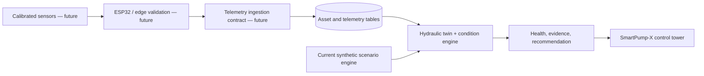

# SmartPump-X

SmartPump-X is a **vendor-neutral centrifugal-pump condition-monitoring demonstrator**. It turns the project specification into a full-stack control-tower foundation with a transparent hydraulic model, explicit data provenance, controlled fault previews, explainable health assessments, and maintenance guidance.

## Current implementation

The first implemented release intentionally focuses on the evidence chain required before a physical prototype is connected:

| Capability | Current behavior | Boundary |
|---|---|---|
| Hydraulic digital twin | Solves a deterministic pump-curve and system-resistance operating point, then derives head, hydraulic power, input power, wire-to-water efficiency, flow residual, and NPSH-margin proxy. | The curve and coefficients are demonstrator assumptions, not manufacturer data or a validated test-rig model. |
| Condition simulator | Produces transparent synthetic scenarios for normal operation, bearing-related behavior, blockage, valve restriction, cavitation-like instability, motor overheating, sensor drift, and reduced flow. | Scenarios are safe software previews; they never operate hardware or assert a physical fault occurred. |
| Health and recommendation logic | Computes a prototype health score from vibration, temperature, flow residual, efficiency, and data-quality penalties; it also exposes evidence and an operator-readable action. | The health score is not remaining useful life, failure probability, or validated predictive-maintenance accuracy. |
| Control tower | Provides health, pump-loop visualization, trend views, engineering calculations, condition explanation, maintenance view, and persistent synthetic-data labels. | Dashboard values are **synthetic** or calculated from synthetic values until calibrated hardware ingestion is added. |
| API and data model | Provides protected tRPC queries for snapshots, trends, engineering details, fault scenarios, and maintenance guidance. Engineer/admin-only scenario-preview requests write an audit-friendly `preview_only` record. The database schema includes assets, telemetry, assessments, events, recommendations, scenarios, and preview runs. | The preview endpoint has no MQTT publish path, actuator, or physical-pump-control capability. |

## Engineering basis

The model uses `P_h = ρgQH`, with fixed water density of 998 kg/m³ and gravity of 9.80665 m/s². The twin solves an intersection between a simplified pump curve and a simplified system curve. Electrical input is derived using a bounded wire-to-water efficiency assumption, so `P_electrical > P_h` by design.

The model is deliberately transparent rather than overclaimed. The present values are suitable for interface development, API validation, fault-workflow design, and unit-test coverage. They must be replaced or calibrated with documented pump-curve data, sensor ranges, sensor placement, sampling rates, calibration results, and a measured system curve before the system can be called an experimentally validated prototype.

## Data provenance and safety

Every dashboard experience must preserve these categories:

| Origin | Meaning |
|---|---|
| `measured` | A calibrated physical instrument captured the value. |
| `calculated` | The value was derived from stated formulas and inputs. |
| `estimated` | A model estimated the value from other inputs. |
| `synthetic` | The value came from the safe demonstration simulator. |

The current release uses synthetic and calculated values only. It has no connection to Pentair production systems, no manufacturer integration, no physical actuator control, and no representation that fault predictions are production validated.

## Technical architecture



## Next physical-integration gate

The next implementation step is **not** more AI. It is a controlled test-rig phase: select the pump and motor, establish the design point, create the Q–H system curve, fit the model to measurements, calibrate the flow/pressure/temperature/vibration/electrical channels, and define a repeatable, safe fault-injection protocol. Only then should MQTT/ESP32 ingestion, persisted event history, and model training be activated.

## Verification

Run the automated suite with:

```bash
pnpm test
pnpm check
```

The current tests verify healthy hydraulic consistency, degradation behavior, suspect sensor drift, trend chronology, and logout behavior.

The release-specific verification gates are recorded in [`docs/acceptance-criteria.md`](docs/acceptance-criteria.md); the deterministic synthetic-data boundary is recorded in [`docs/synthetic-data-contract.md`](docs/synthetic-data-contract.md).
