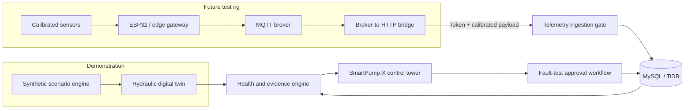

# SmartPump-X

> **A vendor-neutral intelligent pump monitoring demonstrator with a transparent hydraulic digital twin, explainable condition intelligence, and safety-first test governance.**

SmartPump-X is a full-stack mechanical-engineering software demonstrator for a low-pressure centrifugal-pump test rig. It combines an industrial control-tower interface with a deterministic hydraulic model, synthetic fault scenarios, calibrated telemetry-ingestion readiness, and an auditable controlled fault-test workflow.

The project is intentionally **evidence-first**. It distinguishes measured, calculated, estimated, and synthetic values, and it does **not** claim manufacturer integration, physical-pump control, validated remaining-useful-life prediction, or production fault-detection accuracy.

## Why SmartPump-X?

The project addresses a practical engineering challenge: how to build a credible monitoring and condition-management workflow **before** a physical prototype, sensor calibration plan, and controlled fault-injection procedure are complete.

| Engineering challenge | SmartPump-X response |
|---|---|
| Operating point is difficult to explain | A transparent pump-curve and system-resistance digital twin derives flow, head, pressure, power, efficiency, and an NPSH-margin proxy. |
| Early dashboards often overclaim data confidence | Every key value carries an explicit provenance and data-quality boundary. |
| Fault tests need governance | Engineers can request a test; administrators approve or reject it; evidence, closure, and export are persisted in an audit trail. |
| Telemetry needs calibration discipline | The one-way ESP32/MQTT bridge rejects unauthenticated, malformed, out-of-range, unit-mismatched, or uncalibrated payloads. |
| A demo must never control equipment by accident | The software has **no MQTT publish path, actuator endpoint, start/stop command, or pump-speed control capability**. |

## Features

| Area | Included capability |
|---|---|
| **Industrial control tower** | Responsive dark-mode dashboard for health, telemetry, conditions, maintenance, engineering basis, commissioning, telemetry bridge, and test workflow. |
| **Hydraulic digital twin** | Deterministic pump and system curves; flow, head, differential pressure, hydraulic power, electrical power, wire-to-water efficiency, flow residual, and NPSH-margin proxy. |
| **Condition simulator** | Transparent synthetic scenarios for normal operation, bearing degradation, impeller blockage, valve restriction, cavitation-like instability, overheating, sensor drift, and reduced flow. |
| **Operating-envelope assessment** | Visible synthetic guardrails for flow, temperature, vibration, NPSH-margin, and wire-to-water efficiency; clearly labelled as prototype model checks rather than manufacturer limits or operating permission. |
| **Scenario impact comparison** | Side-by-side normal-baseline versus active-scenario deltas at identical browser-local inputs, with an explicit no-field-validation and no-actuation boundary. |
| **Health intelligence** | Explainable prototype health score, confidence, evidence, probable condition, and maintenance recommendation. |
| **Telemetry bridge** | A token-authenticated `POST /api/telemetry/ingest` endpoint for a broker-to-HTTP bridge; calibrated telemetry only. |
| **Telemetry-quality diagnostics** | Authenticated view of accepted telemetry freshness, reported quality mix, latest values by metric, and the bridge safeguards that reject unsafe or uncalibrated payloads. |
| **Calibration governance** | Asset, sensor, metric, unit, valid range, revision, validity date, and approving operator are tracked before telemetry is stored. |
| **Operational readiness** | Authenticated summary of recorded commissioning evidence, currently valid calibration, open high-risk controlled tests, and the fixed one-way interface boundary. |
| **CAD / BOM readiness** | Structured component-selection baseline and commissioning checklist for the future physical rig. |
| **Controlled fault-test governance** | Request → approval/rejection → execution evidence → closure → filtered history → Markdown report export. |

## Architecture



## Technology Stack

| Layer | Technology |
|---|---|
| Frontend | React 19, TypeScript, Tailwind CSS 4, shadcn/ui, Recharts |
| Backend | Express 4, tRPC 11, Zod |
| Persistence | MySQL-compatible database with Drizzle ORM |
| Authentication | Manus OAuth with role-aware procedures |
| Telemetry boundary | Authenticated HTTP ingestion endpoint for an external MQTT bridge |
| Testing | Vitest |

## Quick Start

The synthetic dashboard is public and requires no sign-in. Authentication remains required for operational actions such as creating calibrations, submitting or approving controlled tests, recording evidence, and interacting with the machine telemetry bridge.

The dashboard also includes an **Adjustable simulation inputs** panel. Drive speed, static head, system-resistance multiplier, and inlet temperature are bounded synthetic inputs that recalculate the current local view only. They do not modify database telemetry, publish MQTT messages, or operate equipment.

The public dashboard additionally exposes **Scenario analysis**. It compares the active synthetic condition against the normal synthetic baseline at the same local inputs and displays configured operating-envelope checks. Those checks explain the demonstrator model only; they are not manufacturer operating limits, a permit-to-work, or evidence that a physical fault is present.

| Guest-editable synthetic input | Allowed range | Baseline | Effect on the transparent twin |
|---|---:|---:|---|
| Drive speed | 1,800–3,300 rpm | 2,850 rpm | Rescales the demonstration pump curve and changes the calculated operating point. |
| Static head | 0.5–12 m | 1.8 m | Changes the static component of the system curve. |
| System resistance | 0.35–6.00 × nominal | 1.00 × | Changes the friction/resistance component of the system curve. |
| Inlet temperature | 10–40 °C | 25 °C | Changes the synthetic temperature view and derived temperature trend. |

Values take effect when the field is committed with **Enter** or by moving focus away. Out-of-range entries are clamped intentionally at commit time, and **Reset baseline** restores the documented values. The inputs are held only in browser memory; refreshing the page resets them and no simulation setting is persisted.

### Prerequisites

- Node.js 22 or later
- pnpm 10 or later
- A MySQL-compatible database when running persistence-dependent workflow features

### Install and run

```bash
git clone https://github.com/karanDebugger/SmartPump-X.git
cd SmartPump-X
pnpm install
pnpm dev
```

### Windows (PowerShell)

The npm scripts are cross-platform; no Bash-specific `NODE_ENV=...` syntax is required. In **PowerShell**, use the same commands after installing Node.js 22+ and pnpm 10+:

```powershell
git clone https://github.com/karanDebugger/SmartPump-X.git
Set-Location SmartPump-X
corepack enable
pnpm install
pnpm dev:local
```

`pnpm dev:local` starts the application on `http://localhost:3001`, which is the recommended Windows local-demo URL. `pnpm dev` uses the default available application port. Both scripts work on Windows, macOS, and Linux.

Run the quality checks with:

```bash
pnpm test
pnpm check
```

### Local authentication demo

On `http://localhost` in non-production mode, the **Sign in** button creates a short-lived, signed, HTTP-only **viewer** session for `Local Demo Operator`. This least-privilege path exists only to test the protected control tower without external OAuth credentials. It is unavailable on preview and production hosts, and the resulting session still passes through the same `protectedProcedure` authorization checks as an OAuth session.

For preview or production deployments, external OAuth remains the only sign-in path.

## Safe Demonstration Flow

1. Sign in to the **Control tower**.
2. Open **Conditions** and choose a synthetic scenario, such as *Bearing degradation signature*.
3. Review the health score, evidence, maintenance guidance, and engineering calculations.
4. Open **Test workflow** and submit a **no-actuation** controlled test request.
5. Approve it as an administrator, record software-only evidence, close the record, and download the generated Markdown audit report.

> The demonstration workflow only persists governance records. It does **not** send MQTT messages or operate a pump.

## Telemetry Ingestion Contract

The project is ready for a secure external MQTT bridge. The bridge subscribes to:

```text
smartpump/{assetTag}/telemetry
```

It forwards telemetry to:

```text
POST /api/telemetry/ingest
Header: x-smartpump-telemetry-token: <shared-token>
```

Example payload:

```json
{
  "assetTag": "P-101",
  "sensorKey": "FT-101",
  "metric": "flow",
  "value": 42.1,
  "unit": "L/min",
  "capturedAt": 1760000000000,
  "calibrationRevision": "CAL-FT101-01",
  "quality": "good"
}
```

The service accepts telemetry only after checking the bridge token, strict schema, timestamp window, active calibration revision, unit, and calibrated range. Control-shaped fields such as `command`, `start`, `stop`, `speed`, `setpoint`, and `actuator` are rejected.

An active calibration whose validity date has passed is treated as unavailable by the ingestion gate. Administrators cannot create a calibration record with a past validity date. Authenticated operators can use the readiness panel to identify incomplete commissioning evidence, calibration-expiry risk, and open high-risk controlled tests before relying on the connected-measurement workflow.

The authenticated telemetry-quality panel summarizes only **accepted** measurements. Rejected bridge payloads are intentionally not stored as telemetry. Use the bridge logs to investigate a rejected token, schema, timestamp, calibration, unit, range, or control-shaped-field payload.

See [`docs/mqtt-bridge.md`](docs/mqtt-bridge.md) for the deployment boundary.

## Engineering Basis and Safety Boundaries

The hydraulic basis is:

```text
P_h = ρgQH
η_wire-to-water = P_h / P_electrical
```

The present model uses fixed water density and gravity, plus demonstrator pump-curve and system-resistance assumptions. The model is useful for interface development, workflow validation, API contracts, and design discussion; it is **not** a substitute for a measured Q–H curve, calibrated sensor measurements, or a validated physical test rig.

| Data origin | Meaning |
|---|---|
| `measured` | Captured by a calibrated physical instrument. |
| `calculated` | Derived from stated formulas and traceable inputs. |
| `estimated` | Inferred by a stated model. |
| `synthetic` | Produced by the controlled software simulator. |

## Repository Guide

```text
client/                 React control-tower interface
server/                 tRPC, ingestion, engineering, workflow, and report logic
drizzle/                Database schema and migrations
shared/                 Shared engineering and operations contracts
docs/                   Acceptance criteria, MQTT boundary, and presentation script
server/*.test.ts        Vitest engineering, API, telemetry, and workflow coverage
```

## Documentation

- [`docs/acceptance-criteria.md`](docs/acceptance-criteria.md) — implementation acceptance gates.
- [`docs/synthetic-data-contract.md`](docs/synthetic-data-contract.md) — simulator provenance and data boundary.
- [`docs/mqtt-bridge.md`](docs/mqtt-bridge.md) — one-way telemetry integration contract.
- [`docs/PRESENTATION_SCRIPT_HINGLISH.md`](docs/PRESENTATION_SCRIPT_HINGLISH.md) — ready-to-deliver presentation narrative.

## Roadmap

The next engineering milestones are a selected pump/motor package, detailed CAD assembly, verified system curve, sensor selection and calibration certificates, a physical safety review, a controlled fault-injection test matrix, and a TLS-secured MQTT bridge deployment.

## License

Released under the [MIT License](LICENSE).
